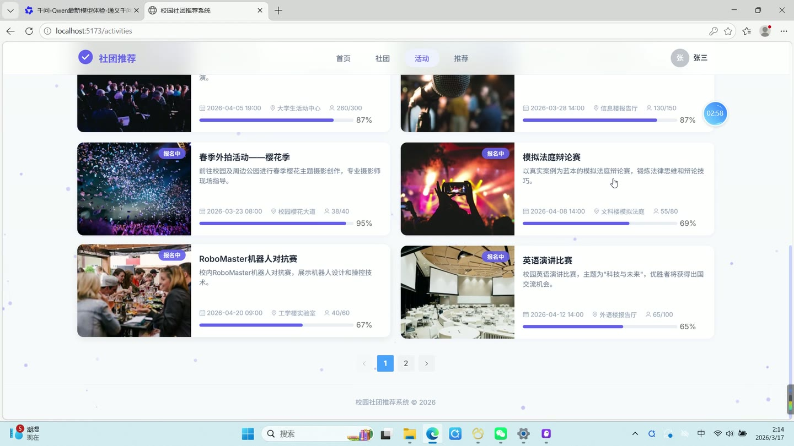
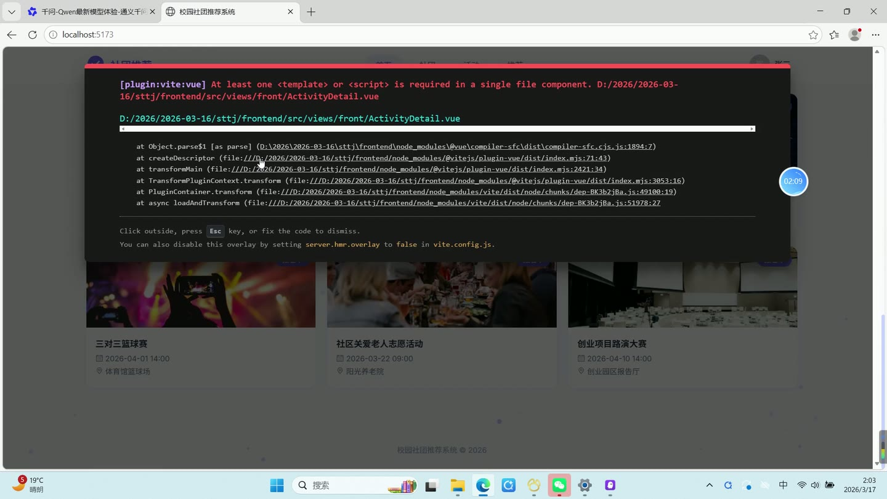

# (附文档)Springboot3+Vue3+MySQL 校园社团推荐系统

**技术栈**：Springboot3、Vue3、MySQL

### 系统简介

校园社团推荐系统是一套基于 Spring Boot 3 + Vue 3 + MySQL 的前后端分离系统。系统面向学生用户与后台管理员，提供社团浏览、活动报名、智能推荐、后台数据管理等核心功能。采用混合推荐算法（协同过滤 + 基于内容 + 热度），根据用户行为动态计算社团推荐列表。
 
### 核心功能
 
### 普通用户端

 
- 注册与登录：填写用户名、密码、昵称、性别、学院、专业、兴趣标签（多选），注册成功后自动跳转登录页；登录后根据角色（STUDENT/ADMIN）跳转不同首页。 
- 首页浏览：查看热门社团（按成员数降序，限8条）、最新活动（按创建时间降序，限6条）、置顶公告（按置顶优先级+时间降序，限5条），数据来自公开接口 /api/front/home。 
- 社团列表：分页浏览所有已上架社团（状态为1），支持按关键字（名称/描述模糊匹配）和分类（学术科技/文化艺术/体育运动/志愿公益/创新创业/兴趣爱好）筛选，默认按评分降序排列。 
- 社团详情：查看社团基本信息（名称、logo、分类、标签、口号、简介、成员数、评分、联系方式、活动地点、封面图）；查看社团成员列表及其角色与状态；查看当前用户在该社团的申请/加入状态（未申请/待审核/已通过/已拒绝）。 
- 社团互动：点击“加入社团”提交申请（状态为待审核），点击“点赞”记录 LIKE 行为（权重3.0），点击“收藏”记录 COLLECT 行为（权重4.0），所有行为均写入 user_behavior 表用于推荐计算。 
- 活动列表：分页浏览所有活动，支持按关键字搜索标题，默认按创建时间降序排列。 
- 活动详情：查看活动标题、描述、封面、地点、开始/结束时间、最大参与人数、当前参与人数、状态（报名中/进行中/已结束）。 
- 活动报名：在活动详情页点击“报名”按钮，系统校验活动是否存在、状态是否为报名中、当前人数是否未满，通过后 currentParticipant 加1并返回成功提示。 
- 智能推荐：进入推荐页，系统根据当前用户的浏览/点赞/收藏/加入行为，结合协同过滤（余弦相似度计算相似用户）、内容推荐（TF-IDF提取社团特征与用户兴趣匹配）、热度推荐（成员数+评分），按混合权重（冷启动时 α=0.1 β=0.5 γ=0.4，有足够行为时 α=0.4 β=0.35 γ=0.25）计算得分，返回 TopN 推荐社团列表。 
- 我的社团：查看当前用户已加入（状态为已通过）的社团列表，数据来自 /api/club/my 接口。 
- 个人中心：查看个人信息（用户名、昵称、头像、邮箱、手机、性别、学院、专业、年级、个人简介、兴趣标签）；编辑个人信息（除密码和角色外的所有字段）；修改密码（需验证原密码，新密码使用 MD5 加盐加密）。 
- 公开统计：首页底部显示社团总数（状态为1的社团）和活动总数，数据来自 /api/front/stats。
 
### 管理员端

 
- 登录与权限控制：管理员使用账号密码登录，后端校验后返回 JWT token 和用户信息，前端根据 role=ADMIN 显示后台入口；路由守卫拦截非管理员访问后台页面。 
- 控制台概览：查看系统总用户数、总社团数、总活动数、已通过成员总数，数据来自 /api/stats/overview。 
- 用户管理：分页查看所有用户列表（支持按昵称/用户名搜索关键字），支持新增用户（用户名唯一性校验）、编辑用户信息（可重置密码）、删除用户（逻辑删除）。 
- 社团管理：分页查看所有社团（含未上架），支持按名称搜索关键字；新增社团（填写名称、分类、口号、标签、简介、封面、最大人数、状态、联系方式、活动地点）；编辑社团信息；删除社团（逻辑删除）。 
- 活动管理：分页查看所有活动，支持按标题搜索关键字；新增活动（填写标题、关联社团ID、描述、封面、地点、开始/结束时间、最大人数、状态）；编辑活动信息；删除活动（逻辑删除）。 
- 公告管理：分页查看所有公告列表（按置顶优先级+时间降序）；新增公告（标题、内容、是否置顶）；编辑公告；删除公告（逻辑删除）。 
- 标签管理：查看所有标签列表；新增标签（名称、分类）；删除标签（物理删除）。 
- 成员审核：查看指定社团的所有成员申请（含待审核/已通过/已拒绝）；审核操作：通过（状态改为1，社团 memberCount 加1）或拒绝（状态改为2）。 
- 数据统计：查看社团分类分布（按分类分组统计数量）；查看用户行为类型分布（VIEW/LIKE/COLLECT/JOIN/RATE 各类型次数）；查看 Top10 热门社团（按成员数降序，限10条）。 
- 文件上传：管理员在新增/编辑社团或活动时，可通过上传组件将图片上传至服务器 /uploads/ 目录，返回可访问的 URL 路径。
 
### 技术栈

 后端框架Spring Boot 3.x ORMMyBatis-Plus（含分页插件、自动填充、逻辑删除） 权限认证JWT（jjwt 生成/校验 Token） + 拦截器（AuthInterceptor） 前端框架Vue 3（Composition API + script setup） 状态管理Pinia（userStore 管理登录状态） UI 组件库Element Plus（表格、表单、弹窗、分页、上传、日期选择器等） 路由Vue Router 4（createWebHistory + 路由守卫） 构建工具Vite 数据库MySQL（MyBatis-Plus 自动建表，逻辑删除字段 deleted） 密码加密MD5 + 固定盐值（campus-salt）
 
### 交付内容

 
- 后端完整源码 
- 前端完整源码 
- 数据库初始化脚本 
- 万字文档

## 界面展示

---

## 获取完整源码 + 万字文档

本仓库为项目介绍页。**完整前后端源码、数据库初始化脚本、万字项目文档**，请加微信 `kangkangcode`，或访问 [codekk.top](http://codekk.top) 获取。

可作课程设计 / 毕业设计参考，支持远程部署调试。